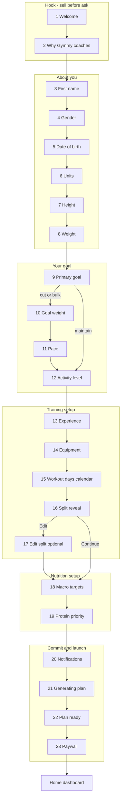

# Gymmy Onboarding Flow v2 - Implementation Spec

**Status:** Approved for implementation  
**Last updated:** 2026-05-23  
**App name:** Gymmy  
**Replaces:** v1 11-step wizard ([`OnboardingFlow.tsx`](../../src/fitness/OnboardingFlow.tsx)), superseded cursor plan `onboarding_hook_+_plan`

**Related docs:**
- [gymmy-tier-matrix.md](./gymmy-tier-matrix.md) - Free vs Pro (screen 23)
- [FTI-69 dailyPlan hotfix](../implementation-artifacts/fti-69-dailyplan-hydration-hotfix.md) - **Phase 0 done**

---

## Goals

1. **Hook before ask** - Sell Gymmy's coaching value before collecting data (Cal AI psychology).
2. **Configure the coach** - Collect everything needed for split, macros, daily tasks, and progress goals.
3. **Resume safely** - Mid-flow quit → pick up where they left off.
4. **Don't break existing users** - Legacy / completed accounts skip full wizard; silent weekday backfill.
5. **End with stakes** - Paywall UI reflects tier matrix; tier stored, gating deferred to IAP sprint.

**Cohesion test (per screen):** Does this help the user answer *"What should I do today and why?"* OR build the data model Gymmy needs to coach them?

---

## Flow overview

**23 core screens** + **1 optional branch** (edit split)



### Progress bar grouping

| Phase | Screens | Label (optional subtitle) |
|-------|---------|---------------------------|
| Hook | 1–2 | - (no step counter on screen 1 optional) |
| About you | 3–8 | "About you" |
| Your goal | 9–12 | "Your goal" |
| Training | 13–17 | "Your training" |
| Nutrition | 18–19 | "Your fuel" |
| Launch | 20–23 | "Launch" |

Show `Step X of 23` on data screens (3+). Hook screens may use Continue-only without numeric step.

---

## Screen-by-screen spec

### Section 1 - Hook

#### Screen 1 - Welcome
| | |
|---|---|
| **Input** | None |
| **Title** | Gymmy |
| **Subtitle** | The only app you need to reach your fitness goals |
| **Body** | Three bullets: Coach you through every workout · Track your fuel and progress · Never need another app |
| **CTA** | Continue |
| **Back** | Hidden |

#### Screen 2 - Why Gymmy coaches
| | |
|---|---|
| **Input** | None |
| **Title** | Your transformation starts here |
| **Body** | Unlike trackers, Gymmy coaches you session by session based on what you actually did last time. |
| **Visual** | Simple icon row or illustration (coach / workout / chart) |
| **CTA** | Continue |
| **Back** | Yes |

---

### Section 2 - About you

#### Screen 3 - First name
| | |
|---|---|
| **Title** | What should we call you? |
| **Subtitle** | Used in your Home greeting and coach notes. |
| **Input** | Text field, optional |
| **CTA** | Continue (or "Skip for now" if empty) |
| **Persists** | `displayName` |

#### Screen 4 - Gender
| | |
|---|---|
| **Title** | What's your gender? |
| **Subtitle** | Used for calorie calculations. |
| **Input** | Male / Female / Other (segment control) |
| **Persists** | `onboardingProfile.gender` |

#### Screen 5 - Date of birth
| | |
|---|---|
| **Title** | When were you born? |
| **Subtitle** | Used for calorie targets and age-appropriate recommendations. |
| **Input** | Native date picker |
| **Validation** | Age 13–100 |
| **Persists** | `onboardingProfile.dateOfBirth` (ISO `YYYY-MM-DD`); derive `age` for TDEE |

#### Screen 6 - Units
| | |
|---|---|
| **Title** | Choose your units |
| **Subtitle** | Weight and height display across the app. |
| **Input** | lbs/kg + ft+in/cm ([`UnitPreferencePicker`](../../src/fitness/UnitPreferencePicker.tsx)) |
| **Persists** | `unitPreferences`, `unitPreferencesChosen: true` |

#### Screen 7 - Height
| | |
|---|---|
| **Title** | How tall are you? |
| **Input** | Single number (cm) or ft + in, per unit preference |
| **Validation** | 48–96 in (122–244 cm) |
| **Persists** | `onboardingProfile.heightIn` |

#### Screen 8 - Current weight
| | |
|---|---|
| **Title** | What's your current weight? |
| **Input** | Single number in chosen weight unit |
| **Validation** | 70–450 lbs equivalent |
| **Persists** | `onboardingProfile.weightLbs` |

---

### Section 3 - Your goal

#### Screen 9 - Primary goal
| | |
|---|---|
| **Title** | What's your primary goal? |
| **Options** | Lose weight → `cut` · Build muscle → `bulk` · Maintain and perform → `maintain` |
| **Persists** | `onboardingProfile.goal` |
| **Branch** | maintain → skip 10–11, go to 12 |

#### Screen 10 - Goal weight *(cut / bulk only)*
| | |
|---|---|
| **Title** | What's your goal weight? |
| **Input** | Target weight in user's unit |
| **Validation** | Cut: current − 5 to current − 80 lbs. Bulk: current + 3 to current + 50 lbs. Min 3 lb delta from current. |
| **Persists** | `onboardingProfile.goalWeightLbs`, `progressGoal` band on finish |

#### Screen 11 - Pace *(cut / bulk only)*
| | |
|---|---|
| **Title** | How fast do you want to get there? |
| **Options** | Slow and steady (~0.5 lb/wk) · Balanced (~1 lb/wk) · Aggressive (~1.5 lb/wk) |
| **Trade-off copy** | Aggressive: "Faster results, but harder to keep muscle if nutrition slips." |
| **Persists** | `onboardingProfile.pace`: `'slow' \| 'balanced' \| 'aggressive'` |
| **Feeds** | Calorie adjustment (see [Pace → macros](#pace--macros)) |

#### Screen 12 - Activity level
| | |
|---|---|
| **Title** | How active are you outside the gym? |
| **Options** | Sedentary · Lightly active · Moderately active · Very active (reuse [`activityLevelLabel`](../../src/fitness/nutritionCalculator.ts)) |
| **Persists** | `onboardingProfile.activityLevel` |

---

### Section 4 - Training setup

#### Screen 13 - Experience
| | |
|---|---|
| **Title** | What's your training experience? |
| **Options** | Beginner (< 1 yr) · Intermediate (1–3 yr) · Advanced (3+ yr) |
| **Component** | [`ExperienceLevelPicker`](../../src/fitness/ExperienceLevelPicker.tsx) |
| **Persists** | `experienceLevel`, `experienceLevelChosen: true` |

#### Screen 14 - Equipment
| | |
|---|---|
| **Title** | What equipment do you have? |
| **Options** | Full gym · Home gym · Dumbbells only · Bodyweight only |
| **Component** | [`EquipmentSetupPicker`](../../src/fitness/EquipmentSetupPicker.tsx) |
| **Persists** | `equipmentSetup`, `equipmentSetupChosen: true` |

#### Screen 15 - Workout days (week calendar) **NEW**

| | |
|---|---|
| **Title** | Which days can you train? |
| **Subtitle** | Pick the days that work for your week. |

**UI layout:**
```
┌─────────────────────────────────────┐
│  Mo  Tu  We  Th  Fr  Sa  Su         │
│  [●] [●] [ ] [●] [●] [ ] [ ]        │
│                                     │
│  4 days selected · Upper/Lower      │
│                                     │
│  [ Pick for me ]                    │
└─────────────────────────────────────┘
```

| Rule | Detail |
|------|--------|
| Toggle row | Mon–Sun, multi-select |
| Min / max | **3–6 days** (matches [`workoutSplitByDays`](../../src/fitness/workoutSplitByDays.ts)) |
| Live hint | `"N days selected · {splitLabel}"` e.g. 4 days → "Upper/Lower" |
| Pick for me | Default spread for count 4: Mon, Tue, Thu, Fri. If user already selected N days, redistribute evenly across the week. |
| Continue disabled | Until 3–6 days selected |

**Persists:** `onboardingProfile.trainingWeekdays: string[]` (e.g. `["Mon","Tue","Thu","Fri"]`)  
**Derived:** `workoutDaysPerWeek = trainingWeekdays.length`  
**On Continue:** `draftTemplates = buildWorkoutTemplatesForDays(days, experience, equipment, trainingWeekdays)`

#### Screen 16 - Split reveal
| | |
|---|---|
| **Title** | Here's your training plan |
| **Body** | List each weekday → session name + estimated time (~52 min) |
| **Actions** | Continue · Edit |
| **Component** | New read-only summary card (reuse session time from FTI-30 patterns) |

#### Screen 17 - Edit split *(optional branch)*
| | |
|---|---|
| **Title** | Customize your program |
| **Component** | [`OnboardingTemplateReview`](../../src/fitness/OnboardingTemplateReview.tsx) |
| **Persists** | `draftTemplates` with `dayLabel` from selected weekdays |

---

### Section 5 - Nutrition

#### Screen 18 - Calculated targets
| | |
|---|---|
| **Title** | Your daily fuel plan |
| **Subtitle** | Based on your stats and goal. Adjust if you know better. |
| **Body** | Calories, protein, carbs, fat + one-line "how we calculated this" |
| **Input** | Manual override fields + "Reset to calculated" |
| **Persists** | `nutritionTargets` |

#### Screen 19 - Protein priority *(interstitial)*
| | |
|---|---|
| **Input** | None |
| **Title** | Protein is your #1 priority |
| **Body** | Hit your protein target every day and the rest handles itself. |
| **CTA** | Continue |

---

### Section 6 - Launch

#### Screen 20 - Notifications
| | |
|---|---|
| **Title** | Stay on track |
| **Subtitle** | Optional reminders. Pro feature when gated - collect preference now. |
| **Component** | [`NotificationPreferencesPicker`](../../src/fitness/NotificationPreferencesPicker.tsx) |
| **Hint** | "Add Gymmy to your home screen for the best notification experience." |
| **Persists** | `notificationPreferences` |

#### Screen 21 - Generating plan *(interstitial)*
| | |
|---|---|
| **Input** | None - auto-advance ~3–4s |
| **Title** | Building your coaching plan… |
| **Steps animation** | Calculating targets → Building your split → Setting up your coach → Ready |

#### Screen 22 - Plan ready
| | |
|---|---|
| **Title** | {name}, your plan is ready |
| **Summary card** | Today's workout or rest · Macro targets · Week schedule preview |
| **CTA** | See my options → Screen 23 |

#### Screen 23 - Paywall
Copy from [gymmy-tier-matrix.md](./gymmy-tier-matrix.md).

| | |
|---|---|
| **Headline** | Unlock your full coaching experience |
| **Primary CTA** | Start 7-day free trial → Home, `subscriptionTier: 'pro'` |
| **Secondary CTA** | Continue with free → Home, `subscriptionTier: 'free'` |
| **Pricing** | $9.99/mo · $79.99/yr (Save 33%) |
| **IAP** | Not wired - both CTAs land on Home |

**On finish (either CTA):**
- `onboardingComplete: true`
- Delete `onboardingDraft`
- Persist profile, templates, macros, notifications, tier
- Regenerate `dailyTasks`, set `planStartIso`
- Request notification permission if toggles enabled

---

## Screens explicitly cut (vs original 30-screen proposal)

| Screen | Reason |
|--------|--------|
| Motivational validation | Duplicates Plan Ready |
| AI transformation (3 screens) | Not built; Profile teaser post-onboarding |
| Saved meals note | Nutrition tab is self-explanatory |
| Separate commitment summary | Merged into Plan Ready |

---

## Data model

### OnboardingProfile (extended)

```typescript
type OnboardingProfile = {
  goal: NutritionGoal;                    // cut | bulk | maintain
  heightIn: number;
  weightLbs: number;
  age: number;                            // derived from dateOfBirth at save
  dateOfBirth: string;                    // ISO YYYY-MM-DD (new; replaces age input)
  gender: UserGender;
  activityLevel: ActivityLevel;
  workoutDaysPerWeek: WorkoutDaysPerWeek; // 3|4|5|6 - derived from trainingWeekdays.length
  trainingWeekdays: string[];             // ["Mon","Tue",...] - source of truth
  goalWeightLbs?: number;                 // cut/bulk only
  pace?: 'slow' | 'balanced' | 'aggressive';  // cut/bulk only
};
```

**Legacy compat:** If `dateOfBirth` missing but `age` present, keep using `age` for TDEE until user completes profile in Settings.

### OnboardingDraft (new - persisted slice)

```typescript
type OnboardingDraft = {
  version: 2;                             // bump when step order changes
  stepIndex: number;                      // 0-based; screen to show on resume
  updatedAtIso: string;
  displayName: string;
  unitPreferences: UnitPreferences;
  experienceLevel: ExperienceLevel;
  equipmentSetup: EquipmentSetup;
  profile: Partial<OnboardingProfile>;
  draftTemplates?: WorkoutRoutineTemplate[];
  macros?: MacroTotals;
  notificationPrefs?: NotificationPreferences;
  subscriptionTier?: 'free' | 'pro';
};
```

### AppState additions

```typescript
onboardingDraft?: OnboardingDraft | null;
subscriptionTier?: 'free' | 'pro';
```

### Pace → macros

Extend [`calculateNutritionTargets`](../../src/fitness/nutritionCalculator.ts) with pace-based adjustment on top of goal base:

| Pace | Cut (daily kcal vs TDEE+goal) | Bulk (daily kcal vs TDEE+goal) |
|------|-------------------------------|--------------------------------|
| slow | ~−250 kcal/week (~−36/day) | ~+150 kcal/week |
| balanced | ~−500 kcal/week (~−71/day) | ~+300 kcal/week (current default) |
| aggressive | ~−750 kcal/week (~−107/day) | ~+450 kcal/week |

Maintain goal: no goal weight, no pace, standard TDEE.

### Template weekday mapping

Update [`buildWorkoutTemplatesForDays`](../../src/fitness/workoutSplitByDays.ts):

```typescript
buildWorkoutTemplatesForDays(
  days: WorkoutDaysPerWeek,
  level: ExperienceLevel,
  equipment: EquipmentSetup,
  trainingWeekdays?: string[],  // assign dayLabel[i] = trainingWeekdays[i]
): WorkoutRoutineTemplate[]
```

Phase 0 [`migrateTrainingSchedule`](../../src/fitness/migrateTrainingSchedule.ts) already backfills weekdays for existing users; onboarding v2 sets them explicitly.

---

## Resume-from-step

| Event | Behavior |
|-------|----------|
| Continue on any step | Serialize full draft → persist slice + cloud sync |
| App close / refresh | If `!onboardingComplete && onboardingDraft` → open at `stepIndex` |
| Back | Decrement step, save draft |
| Paywall finish | `onboardingComplete: true`, clear draft |
| Dev preview (`?previewOnboarding=1`) | Draft saves; finish does **not** set `onboardingComplete` |
| Draft `version !== 2` | Reset to step 0, toast: "We updated onboarding - please start fresh" |

**UX:** Optional "Progress saved" fade (2s) after Continue. Settings → "Restart onboarding" clears draft (future).

---

## Existing user migration

Skip logic ([`onboardingSkip.ts`](../../src/fitness/onboardingSkip.ts)) unchanged:

```
Skip if: onboardingComplete
      OR legacy email (VITE_LEGACY_USER_EMAILS)
      OR hasExistingFitnessData (workouts or weight log)
```

| User type | v2 behavior |
|-----------|-------------|
| Legacy email / completed onboarding | Skip wizard; silent `trainingWeekdays` backfill (FTI-69) |
| New account, no data | Full 23-screen flow |
| Mid-draft | Resume at `stepIndex` |
| Missing v2 fields (DOB, goal weight, pace) | Optional Home banner → Settings subset, **not** full re-onboarding |

---

## First-load hydration (Phase 0 - done)

Implemented in FTI-69. Do not render Home until:
- No Supabase → immediate after local migrate
- Supabase, no session → auth screen
- Supabase + session → first pull complete or 5s timeout

Migration is **sync** inside `buildAppStateFromPersisted` before `loadTasksForToday`.

---

## Validation matrix

Continue disabled until valid. Inline error below field.

| Screen | Field | Rule | Error copy |
|--------|-------|------|------------|
| 3 | displayName | Optional; 1–40 chars if present | - |
| 5 | dateOfBirth | Age 13–100 | Enter a valid date of birth (13+) |
| 7 | heightIn | 48–96 in | Enter a height between 4'0" and 8'0" |
| 8 | weightLbs | 70–450 lbs | Enter a weight between 70 and 450 lbs |
| 10 | goalWeightLbs | Direction + range per goal | Goal weight should be [range] for your goal |
| 11 | pace | Required if cut/bulk | - |
| 15 | trainingWeekdays | 3–6 days | Pick 3–6 training days |
| 18 | macros | cal 1200–6000; p 50–400; c 0–800; f 20–300 | Enter a value in range |
| 20 | reminder times | Valid HH:MM if toggle on | Pick a reminder time |

**Sync failure mid-flow:** Non-blocking toast; draft saved locally; never roll back step.

---

## Component architecture

```
OnboardingFlow.tsx          - step machine, branching, draft save
OnboardingShell.tsx         - progress bar, back/continue (extract from current)
OnboardingInterstitial.tsx  - zero-input screens (1, 2, 19, 21)
WorkoutWeekCalendarPicker.tsx - NEW screen 15
OnboardingSplitReveal.tsx   - NEW screen 16 read-only summary
OnboardingPaywall.tsx       - NEW screen 23
OnboardingPlanReady.tsx     - NEW screen 22

Reuse: UnitPreferencePicker, ExperienceLevelPicker, EquipmentSetupPicker,
       OnboardingTemplateReview, NotificationPreferencesPicker, OnboardingSegment
```

**Dev tooling:** Keep [`DevOnboardingToolbar`](../../src/fitness/DevOnboardingToolbar.tsx) + `?previewOnboarding=1`.

---

## Implementation stories (remaining)

| Order | Story | Status |
|-------|-------|--------|
| 0 | FTI-69 dailyPlan + hydration hotfix | **Done** |
| 1 | Tier matrix doc | **Done** |
| 2 | This spec doc | **Done** |
| 3 | FTI-70 Data model + onboardingDraft + profile fields | Pending |
| 4 | FTI-71 WorkoutWeekCalendarPicker | Pending |
| 5 | FTI-72 Onboarding flow rewrite (23 screens) | Pending |
| 6 | FTI-73 Template weekday mapping in split builder | Pending |
| 7 | FTI-74 OnboardingPaywall UI stub | Pending |
| 8 | FTI-75 Onboarding E2E (full flow + resume) | Pending |

---

## Out of scope (v2)

- Real IAP / Stripe / App Store
- Feature gating by tier (store only until IAP sprint)
- AI transformation onboarding screens
- Referral codes, rate-app prompt, Apple Health (post-onboarding entry points)
- Global Fitcoach → Gymmy rename outside onboarding copy
- Blurred coach notes UX (ship with IAP gating story, not onboarding v2)

---

## Acceptance criteria (epic-level)

1. New user completes 23 screens and lands on Home with split, macros, daily tasks, and tier stored.
2. Quit on screen 15 → reload → resumes screen 15.
3. Week calendar enforces 3–6 days; Pick for me selects valid spread.
4. Maintain goal skips goal weight + pace.
5. Legacy / completed users skip wizard; Home shows correct workout for their split (FTI-69).
6. Paywall shows tier matrix copy; both CTAs reach Home.
7. `npm test` + `npm run build` pass; Playwright covers happy path + resume.
