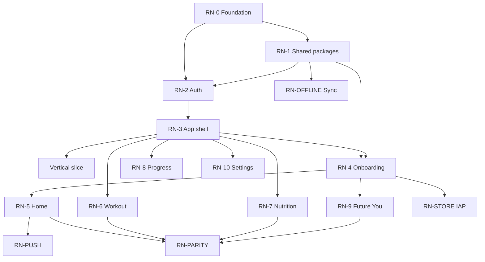

# RN Migration Timeline

## Phased rollout

| Phase | Weeks | Goal | Exit criteria |
|-------|-------|------|---------------|
| **Planning** | 1 | Phases 0–9 artifacts | Readiness READY WITH NOTES ✅ |
| **Foundation** | 2–3 | RN-0, RN-0 Maestro | Dev client on simulator, CI green |
| **Platform** | 2–3 | RN-1 package extraction | Vitest green in packages/* |
| **Auth + shell** | 2–3 | RN-2, RN-3 | Auth E2E + tab shell |
| **Vertical slice** | 2–3 | Onboarding[0-5] + home | First Maestro parity path |
| **Feature parity** | 12–14 | RN-4–RN-10, RN-PUSH, RN-OFFLINE | Trace matrix verified |
| **Hardening** | 2–3 | Performance, a11y, edge cases | UAT sign-off |
| **App Store** | 2–3 | RN-STORE, RN-PARITY | TestFlight → production approved |

**Total implementation:** ~24–28 weeks after planning (solo + AI)

## Epic sequence & dependencies

## Parallel workstreams

| Stream | Rule |
|--------|------|
| PWA maintenance | Bugfixes only after RN-3 complete |
| PWA feature freeze | Recommend week 8 of implementation |
| FTI Linear sprint | Separate RN backlog; don't mix with Sprint 11 |

## Milestones (relative)

| Milestone | Target week | Deliverable |
|-----------|-------------|-------------|
| M1 Dev client runs | Week 3 | RN-0 complete |
| M2 Auth E2E green | Week 8 | RN-2 + Maestro auth |
| M3 Vertical slice | Week 11 | Onboarding partial + home |
| M4 Feature complete | Week 22 | All FR-M* implemented |
| M5 TestFlight | Week 25 | RN-STORE |
| M6 App Store | Week 28 | RN-PARITY signed |

## Story counts by epic

See `epics-rn-migration.md` — 107 stories total, ~2.5 stories/week sustained
