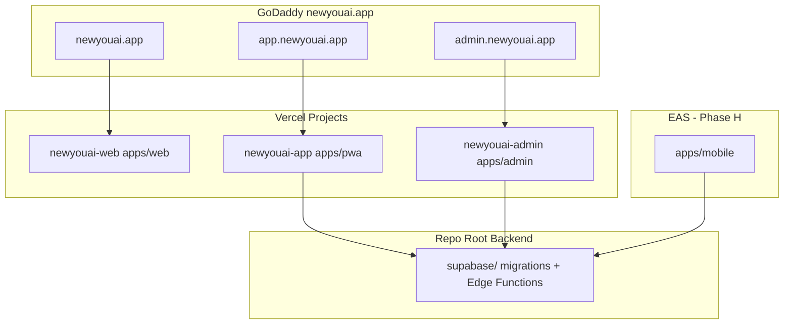
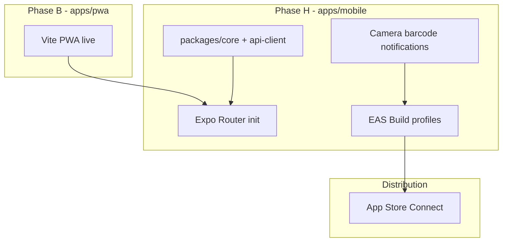

# New You AI — Turborepo Monorepo Migration Plan

## Executive Summary

- **Verified today:** Single-package **React 18 + Vite 5 + TypeScript PWA** (~429 files in `src/fitness/`), **Supabase** backend (6 migrations, 7 Edge Functions), deployed implicitly on **Vercel**, CI via **GitHub Actions** (build + Vitest + Playwright). **No** marketing site, admin UI, Expo/RN, monorepo, or `turbo.json`.
- **Assumption corrections:** Marketing and admin are **not built** (confirmed). Native iOS is **not built**; PRD listed App Store wrapper as a **non-goal** in Sprint 2 but Future You docs now anticipate IAP/App Store — migration plan treats iOS as **Phase 8+**.
- **Recommended scope:** `@newyouai/*` per product rebrand; apex domain **`newyouai.app`** for marketing, **`app.newyouai.app`** for the live product PWA (best separation for Vercel projects, SEO, cookies, and eventual Expo handoff).
- **Strategy:** Move-first (PWA → `apps/pwa`), extract shared packages second, greenfield marketing third, admin fourth, Expo mobile last — **no big-bang rewrite**.
- **Styling split:** Existing app uses a **7,400-line global CSS file** ([`src/index.css`](src/index.css)); new `apps/web` and `apps/admin` use **Tailwind via `packages/config`**; do **not** force Tailwind onto the PWA until mobile rewrite.
- **Supabase stays at repo root** ([`supabase/`](supabase/)) — unchanged location, shared by all apps.
- **Highest-risk areas:** React 18 → 19 if Next 15 pushes it; DOM-only deps (`@zxing/browser`, `framer-motion`, `@ark-ui/react`); `localStorage` keys (`fitcoach:persist:v1`); hardcoded `gymmy.app` legal URLs in [`src/fitness/futureYouLegal.ts`](src/fitness/futureYouLegal.ts).
- **Day-1 shared packages:** `packages/config`, `packages/types`, `packages/api-client` (thin Supabase wrappers); stub `packages/ui`.
- **Solo-dev timeline:** Scaffold + PWA move (~1–2 weeks), marketing shell (~1 week), admin MVP (~2 weeks), Turbo/CI/Vercel wiring (~3–5 days), Expo init (~2–4 weeks parallel).

---

## Phase 1 — Discovery Report

### 1.1 Inventory

| Area | Finding |
|------|---------|
| **Root structure** | Flat SPA at repo root: [`src/`](src/), [`public/`](public/), [`e2e/`](e2e/), [`scripts/`](scripts/), [`supabase/`](supabase/), [`_bmad-output/`](_bmad-output/) |
| **Package manager** | **npm** — [`package-lock.json`](package-lock.json) lockfileVersion 3; **no workspaces** |
| **Node version** | No `.nvmrc`; CI pins **Node 22** ([`.github/workflows/ci.yml`](.github/workflows/ci.yml)) |
| **Framework** | React 18.3 + Vite 5.4 + TypeScript 5.6 SPA |
| **Bundler** | Vite ([`vite.config.ts`](vite.config.ts)) with `@` → `src/` alias, `vite-plugin-svgr` |
| **Routing** | **No react-router** — tab state in [`src/fitness/FitnessApp.tsx`](src/fitness/FitnessApp.tsx); shell gate in [`src/fitness/appShellRouting.ts`](src/fitness/appShellRouting.ts) |
| **State** | `useState` + React Context; persistence via [`src/fitness/persistFitnessSlice.ts`](src/fitness/persistFitnessSlice.ts) → `localStorage` key `fitcoach:persist:v1` |
| **Styling** | Global CSS variables in [`src/index.css`](src/index.css); `framer-motion`, `@ark-ui/react`, `@tabler/icons-react` — **no Tailwind** |
| **PWA** | [`public/site.webmanifest`](public/site.webmanifest) (`display: standalone`); Apple meta in [`index.html`](index.html); **notification-only** SW at [`public/notification-sw.js`](public/notification-sw.js) — **no offline precache**, no `vite-plugin-pwa` |
| **Backend** | **Supabase only** — Auth, Postgres+RLS, Storage, 7 Deno Edge Functions in [`supabase/functions/`](supabase/functions/) |
| **Auth** | Supabase GoTrue via [`src/fitness/supabaseClient.ts`](src/fitness/supabaseClient.ts); email/password active; OAuth wired but Apple UI disabled |
| **Deploy** | No `vercel.json`; `VITE_VERCEL_ENV` injected in [`vite.config.ts`](vite.config.ts); likely single Vercel project today |
| **CI** | One workflow: `npm ci` → `build` → `test` → Playwright E2E |
| **Tests** | **97** Vitest unit tests (`src/**/*.test.ts`, node env); **7** Playwright specs in [`e2e/`](e2e/); **no coverage** config; no ESLint in CI |

**Product naming (in repo today):**

| Name | Where |
|------|-------|
| **New You AI** | User-confirmed target brand |
| **Fitcoach** | PRD / project-context working title |
| **Gymmy** | Retired; still in legal URL defaults |
| **fitnesstracker** | npm `name` in [`package.json`](package.json) |
| **Jimmy: Personal Fitness OS** | PWA manifest `name` |

### 1.2 Code Reuse Map

| Area | Current location | Recommended strategy |
|------|------------------|----------------------|
| **Pure business logic** | `src/fitness/*.ts` (coach, nutrition, workouts, onboarding models, Future You guards) | **Extract** → `packages/core` or `packages/fitness` (~97 test files move with logic) |
| **API / Supabase client** | `supabaseClient.ts`, `*Service.ts`, `fitnessCloudSync.ts` | **Extract** → `packages/api-client` with per-app storage adapters |
| **Types / Zod** | `src/fitness/types.ts`, domain models | **Extract** → `packages/types` |
| **Brand / tokens** | `src/index.css` CSS vars, `src/assets/brand-icons/` | **Dual track:** CSS vars stay in PWA; **new** Tailwind tokens in `packages/config` for web/admin |
| **UI components** | `src/fitness/*.tsx`, `src/components/ui/` | **PWA stays put** initially; **rewrite** for Expo (RN primitives); **new** shared web primitives in `packages/ui` for marketing/admin only |
| **Auth session** | `FitnessSyncContext.tsx`, `supabaseClient.ts` | **Shared types** in `packages/types`; **adapters:** Vite `localStorage` vs Next cookies vs Expo `SecureStore` + `@supabase/supabase-js` |
| **Service worker** | `notification-sw.js` | **Web/PWA only** — Expo uses `expo-notifications`; document split in `docs/mobile-notifications.md` |
| **E2E / unit tests** | `e2e/`, `src/**/*.test.ts` | Stay with `apps/pwa` until mobile has its own test target; root `turbo run test` filters by package |
| **Edge Functions** | `supabase/functions/` | **Unchanged** at repo root; not a Turborepo package |

### 1.3 Gap Analysis

**PWA → `apps/mobile` vs web-only?**

| Stays web/PWA (interim `apps/pwa`) | Moves to Expo (`apps/mobile`) |
|-----------------------------------|------------------------------|
| Full tab UI, onboarding flows, 7k-line CSS | Same screens rebuilt with RN + Expo Router |
| `@zxing/browser` barcode ([`BarcodeScanner.tsx`](src/fitness/BarcodeScanner.tsx)) | `expo-camera` + `expo-barcode-scanner` |
| Web Notifications + `notification-sw.js` | `expo-notifications` + APNs |
| `framer-motion`, `@ark-ui/react`, DOM sheets | `react-native-reanimated`, RN modal/sheet libs |
| `localStorage` persist slice | `expo-secure-store` / MMKV adapter behind `packages/api-client` |
| Installable PWA manifest | App Store binary via EAS |

**Does PWA become `apps/web`?** **No.** `apps/web` is **greenfield Next.js marketing** at `newyouai.app`. The product moves to **`apps/pwa`** (interim), then **`apps/mobile`** (Expo). Keeping the PWA alive on `app.newyouai.app` avoids blocking users during Expo build-out.

**Admin MVP vs later (based on existing Supabase schema + Edge Functions):**

| MVP (v1) | Later |
|----------|-------|
| Staff auth gate (Supabase allowlist or `admin_users` table) | Full RBAC roles |
| `/users` — search auth users, view `fitness_user_data` summary, trigger `delete-user` | Impersonation, bulk ops |
| `/future-you` — job queue monitor (`future_you_jobs`), failed job retry/cancel | Cost dashboards, OpenAI quota alerts |
| `/community-foods` — moderate `community_foods` submissions | Automated spam detection |
| `/settings` — feature flags, legal URL config | Tier/IAP management |
| `/` dashboard — counts (users, active jobs, food submissions) | Product analytics (PostHog/Plausible) |

Defer: blog CMS (unless marketing needs it day 1), cron UI (use Supabase cron + dashboard initially), IAP admin (until App Store ships).

**iOS path:**

- **Expo managed workflow + dev client** (matches Family Care OS pattern); prebuild when native modules needed.
- **Code-sharing estimate:** ~**35–45%** of TS logic reusable (models, coach engine, nutrition math, sync merge, Future You guards); ~**5–10%** of UI reusable; **0%** of CSS/framer-motion/ark-ui.
- **Native modules needed:** Camera (Future You photos, progress pics), barcode scanner, push notifications, secure storage, possibly `expo-media-library` (save image — [`saveImageToDevice.ts`](src/fitness/saveImageToDevice.ts)), StoreKit (IAP — documented in Future You checklist).

### 1.4 Risks

| Risk | Severity | Mitigation |
|------|----------|------------|
| React 18 (PWA) vs React 19 (Next 15 default) | Medium | Pin React 18 across monorepo initially; upgrade PWA + Expo together |
| 7k-line CSS untransferable to RN | High | Accept PWA CSS stays in `apps/pwa`; design tokens duplicated in `packages/config` for new apps |
| `gymmy.app` hardcoded fallbacks | Low | Update [`futureYouLegal.ts`](src/fitness/futureYouLegal.ts) → `newyouai.app/privacy` during Phase 2 |
| `fitcoach:*` localStorage keys | Low | Keep keys for backward compat; rename in a later migration with migration shim |
| Secrets in `.env` (gitignored) | Medium | Root `.env.example` matrix per app; never `VITE_*` for service role |
| Single-app Playwright paths | Medium | Update `playwright.config.ts` to `apps/pwa` cwd after move |
| App Store review (Future You AI body imagery) | High | Existing risk doc: [`_bmad-output/planning-artifacts/ai-transformation-photo-risks.md`](_bmad-output/planning-artifacts/ai-transformation-photo-risks.md) |
| No admin RLS policies today | Medium | Admin uses **service role** only server-side in Next.js Route Handlers — never expose to client |

---

## Phase 2 — Migration Plan

### 2.1 Recommended Target Tree

```
newyouai/  (repo root — rename optional)
├── apps/
│   ├── pwa/                    # @newyouai/pwa — CURRENT Vite product (app.newyouai.app)
│   │   ├── src/                # moved from root src/
│   │   ├── public/             # manifest, notification-sw, favicon
│   │   ├── e2e/                # Playwright specs
│   │   ├── index.html
│   │   ├── vite.config.ts
│   │   ├── playwright.config.ts
│   │   └── package.json
│   ├── web/                    # @newyouai/web — Next.js 15 marketing (newyouai.app)
│   ├── admin/                  # @newyouai/admin — Next.js 15 staff dashboard (admin.newyouai.app)
│   └── mobile/                 # @newyouai/mobile — Expo (Phase 8+, EAS)
├── packages/
│   ├── config/                 # @newyouai/config — Tailwind preset, eslint, tsconfig bases
│   ├── types/                  # @newyouai/types — shared TS types
│   ├── api-client/             # @newyouai/api-client — Supabase + Edge Function clients
│   ├── core/                   # @newyouai/core — pure fitness business logic (extracted incrementally)
│   └── ui/                     # @newyouai/ui — stub → shared web components (admin + marketing)
├── supabase/                   # UNCHANGED — migrations, functions, config.toml
├── docs/
│   ├── setup.md
│   ├── env-matrix.md
│   ├── vercel.md
│   └── eas-ios.md
├── scripts/                    # Root scripts (checkSupabaseEnv → apps/pwa or shared)
├── turbo.json
├── package.json                # workspaces: ["apps/*", "packages/*"]
├── .nvmrc                      # 22
└── README.md
```

**Domain map:**

| App | Vercel project | Domain | Purpose |
|-----|----------------|--------|---------|
| `@newyouai/web` | `newyouai-web` | `newyouai.app` | Marketing, SEO, `/privacy`, `/terms` |
| `@newyouai/pwa` | `newyouai-app` | `app.newyouai.app` | Live product (current users) |
| `@newyouai/admin` | `newyouai-admin` | `admin.newyouai.app` | Staff dashboard |
| `@newyouai/mobile` | — (EAS) | App Store | Native iOS |

**What moves where (existing files):**

| Current path | Destination |
|--------------|-------------|
| [`src/`](src/) | `apps/pwa/src/` |
| [`public/`](public/) | `apps/pwa/public/` |
| [`e2e/`](e2e/) | `apps/pwa/e2e/` |
| [`index.html`](index.html) | `apps/pwa/index.html` |
| [`vite.config.ts`](vite.config.ts) | `apps/pwa/vite.config.ts` |
| [`playwright.config.ts`](playwright.config.ts) | `apps/pwa/playwright.config.ts` |
| [`playwright.auth.config.ts`](playwright.auth.config.ts) | `apps/pwa/playwright.auth.config.ts` |
| [`tsconfig.json`](tsconfig.json) + [`tsconfig.app.json`](tsconfig.app.json) + [`tsconfig.node.json`](tsconfig.node.json) | `apps/pwa/` + new root `tsconfig.json` (solution references only) |
| [`package.json`](package.json) deps | `apps/pwa/package.json`; root keeps workspaces-only manifest |
| [`package-lock.json`](package-lock.json) | **stays at root** (single npm lockfile for all workspaces) |
| [`deno.lock`](deno.lock) | **stays at root** (Supabase Edge Functions) |
| [`supabase/`](supabase/) | **stays at root** |
| [`scripts/checkSupabaseEnv.mjs`](scripts/checkSupabaseEnv.mjs) | `apps/pwa/scripts/` |
| [`scripts/futureYouPromptSpike.mjs`](scripts/futureYouPromptSpike.mjs), [`scripts/futureYouSmoke.mjs`](scripts/futureYouSmoke.mjs) | **stay at root** `scripts/` (dev/ops tooling, not app runtime) |
| [`_bmad-output/`](_bmad-output/) | **stays at root** (planning artifacts) |
| [`.agents/`](.agents/) | **stays at root** |

---

### 2.2 Phased Execution

#### Phase A — Scaffold monorepo (S)

**Goal:** Empty monorepo skeleton; root installs work; no app code moved yet.

**Create/modify:**

- Root [`package.json`](package.json) — workspaces-only manifest (see §2.10 root split template)
- [`turbo.json`](turbo.json) — task graph (see §2.3)
- [`.nvmrc`](.nvmrc) — `22`
- [`.gitignore`](.gitignore) — add `.turbo`, `apps/*/.next`, `apps/mobile/.expo`
- [`README.md`](README.md) — dev commands
- Stub all `packages/*` with **required scripts** (see §2.5 package template) so `^build` never dead-ends
- New root `tsconfig.json` (solution references only — added in Phase B after PWA tsconfig moves)

**Root `package.json` split (keep at repo root after Phase B):**

```json
{
  "name": "newyouai",
  "private": true,
  "workspaces": ["apps/*", "packages/*"],
  "scripts": {
    "dev": "turbo run dev",
    "dev:pwa": "turbo run dev --filter=@newyouai/pwa",
    "build": "turbo run build",
    "test": "turbo run test",
    "test:e2e": "turbo run test:e2e --filter=@newyouai/pwa",
    "typecheck": "turbo run typecheck"
  },
  "devDependencies": { "turbo": "^2.5.0" },
  "engines": { "node": ">=22" }
}
```

All runtime deps move to `apps/pwa/package.json`. Single [`package-lock.json`](package-lock.json) stays at root (npm hoists to root `node_modules/`).

**Commands:**

```bash
# From repo root (after files created)
npm install turbo --save-dev -w .
npm install
npx turbo run build --dry-run
```

**Acceptance criteria:** See §2.10 Phase A checklist.

**Rollback:** Revert root `package.json` workspace fields; delete `turbo.json`, `apps/`, `packages/`.

---

#### Phase B — Move PWA → `apps/pwa` (M–L)

**Goal:** Entire product builds and tests from `apps/pwa` with git history preserved.

**Approach:** Use `git mv` for tracked files (not copy-delete).

**Pre-flight (required):**

```bash
git status --porcelain   # must be clean — commit or stash first
```

**Modify:**

- Move all SPA files per table above
- `apps/pwa/package.json` — `"name": "@newyouai/pwa"`, inherit all deps/scripts from current root `package.json`
- `apps/pwa/vite.config.ts` — `loadEnv(mode, path.dirname(fileURLToPath(import.meta.url)), "VITE_")` (not repo-root cwd)
- `apps/pwa/playwright.config.ts` — set `webServer.cwd` to `__dirname`; build command uses workspace filter
- New **root** `tsconfig.json` — references only: `{ "files": [], "references": [{ "path": "apps/pwa" }, { "path": "packages/config" }] }`
- Root `package.json` — workspaces-only manifest (§2.10); drop moved deps

**Commands:**

```bash
mkdir -p apps/pwa packages/{config,types,api-client,core,ui}
git mv src apps/pwa/src
git mv public apps/pwa/public
git mv e2e apps/pwa/e2e
git mv index.html vite.config.ts tsconfig.json tsconfig.app.json tsconfig.node.json apps/pwa/
git mv playwright.config.ts playwright.auth.config.ts apps/pwa/
mkdir -p apps/pwa/scripts && git mv scripts/checkSupabaseEnv.mjs apps/pwa/scripts/
# Move package.json deps into apps/pwa/package.json (manual merge step)
npm install
npm run dev --workspace=@newyouai/pwa
npm run build --workspace=@newyouai/pwa
npm run test --workspace=@newyouai/pwa
npm run test:e2e --workspace=@newyouai/pwa
```

**Acceptance criteria:** See §2.10 Phase B checklist.

**Rollback:** `git mv` back to root layout; restore single-package `package.json`. Run checkpoint before Phase F.

---

#### Phase C — Extract `packages/config` + `packages/types` (S)

**Goal:** Minimal shared surface for new apps; **end with PWA importing `@newyouai/types`** (single source).

**`packages/config`:**

- `tailwind.preset.ts` — colors matching PWA dark theme (`#0a0a0a`, accent from CSS vars)
- `eslint.config.mjs` (optional — add before enabling `turbo run lint` in CI)
- `tsconfig.base.json`

**`packages/types` (two-step — avoids drift):**

1. **Copy** `apps/pwa/src/fitness/types.ts` + API response shapes into `packages/types/src/`
2. **Wire PWA:** change `apps/pwa` imports to `@newyouai/types`; re-export shim in old `types.ts` for one PR if needed
3. **Delete duplicate** `apps/pwa/src/fitness/types.ts` in follow-up commit once all imports updated

**Milestone:** `grep -r "from './types'" apps/pwa/src/fitness` returns zero hits; only `@newyouai/types` imports remain.

**Acceptance criteria:** See §2.10 Phase C checklist.

---

#### Phase D — Scaffold `apps/web` — Next.js marketing (M)

**Goal:** Public site at `/`, `/about`, `/pricing`, `/privacy`, `/terms`; blog stub at `/blog`.

**Create:**

```
apps/web/
├── app/
│   ├── layout.tsx
│   ├── page.tsx              # landing
│   ├── about/page.tsx
│   ├── pricing/page.tsx
│   ├── privacy/page.tsx      # migrate content from gymmy.app
│   ├── terms/page.tsx
│   └── blog/page.tsx         # stub
├── next.config.ts
├── tailwind.config.ts        # extends @newyouai/config
└── package.json              # @newyouai/web, next@15, react@18
```

**Update PWA:** `VITE_PRIVACY_POLICY_URL=https://newyouai.app/privacy`, `VITE_TERMS_URL=https://newyouai.app/terms`

**Acceptance criteria:** See §2.10 Phase D checklist.

---

#### Phase E — Scaffold `apps/admin` — Next.js staff dashboard (L)

**Goal:** Auth-gated admin shell with Supabase service-role **server-only** access.

**Create:**

```
apps/admin/
├── app/
│   ├── layout.tsx
│   ├── login/page.tsx
│   ├── (protected)/
│   │   ├── layout.tsx        # auth gate middleware
│   │   ├── page.tsx          # dashboard stats
│   │   ├── users/page.tsx
│   │   ├── future-you/page.tsx
│   │   ├── community-foods/page.tsx
│   │   └── settings/page.tsx
├── middleware.ts             # staff session check
├── lib/supabase-admin.ts     # service role — server only
└── package.json
```

**Auth pattern:** Supabase Auth for staff emails on allowlist table (`admin_users`) **or** env `ADMIN_ALLOWED_EMAILS` for MVP.

**Security guards (required):**

- `lib/supabase-admin.ts` — add `import "server-only"`; never import from `app/**/*.tsx` client components
- `apps/admin/eslint.config.mjs` — `no-restricted-imports` blocking `@/lib/supabase-admin` from non-`app/api/` and non-server files
- `middleware.ts` — reject session if email not in `ADMIN_ALLOWED_EMAILS` (or `admin_users` table)
- **Build guard:** `apps/admin` build script fails if `ADMIN_ALLOWED_EMAILS` is empty when `VERCEL_ENV=production`
- Service role key only in Vercel **server** env for `newyouai-admin` project — never `NEXT_PUBLIC_*`

**Acceptance criteria:** See §2.10 Phase E checklist.

---

#### Phase F — Wire Turborepo tasks (S)

See §2.3. Update root scripts:

```json
{
  "dev": "turbo run dev",
  "dev:pwa": "turbo run dev --filter=@newyouai/pwa",
  "dev:web": "turbo run dev --filter=@newyouai/web",
  "dev:admin": "turbo run dev --filter=@newyouai/admin",
  "build": "turbo run build",
  "test": "turbo run test",
  "test:e2e": "turbo run test:e2e --filter=@newyouai/pwa",
  "lint": "turbo run lint",
  "typecheck": "turbo run typecheck"
}
```

**Acceptance criteria:** See §2.10 Phase F checklist.

---

#### Phase G — Vercel projects + DNS + Auth URLs (M)

See §2.4. Three Vercel projects, same GitHub repo.

**Critical (ordered):**

1. Complete Phase F first — turbo build must work before changing Vercel Root Directory.
2. Update **existing** Vercel project → Root Directory `apps/pwa`; assign `app.newyouai.app`.
3. Create `newyouai-web` → `apps/web`; assign apex `newyouai.app`.
4. Create `newyouai-admin` → `apps/admin`; assign `admin.newyouai.app`.
5. **GoDaddy DNS:** CNAME `app` and `admin` → Vercel; apex → Vercel (or redirect).
6. **Supabase Dashboard → Auth → URL Configuration:** add `https://app.newyouai.app/**` to redirect allow list; update site URL if needed.

**Acceptance criteria:** See §2.10 Phase G checklist.

**Rollback:** Document previous Vercel Root Directory + domain mapping before switch; revert in Vercel UI.

---

#### Phase H — Mobile iOS pipeline (L — parallel track)

See §2.7 and §2.11 parity checklist. Init `apps/mobile` with Expo Router after Phase B stabilizes.

**Acceptance criteria:** See §2.10 Phase H checklist.

---

#### Phase I — Decommission old paths (S)

- Remove duplicate root `vite.config.ts`, empty root `src/`
- Update [`.github/workflows/ci.yml`](.github/workflows/ci.yml) per §2.6 (turbo + cache strategy)
- Add `docs/setup.md`, `docs/env-matrix.md` (from §2.4.1), `docs/vercel.md`, `docs/eas-ios.md`
- Update [`_bmad-output/project-context.md`](_bmad-output/project-context.md) paths to `apps/pwa/src/fitness/`
- Copy this plan → [`_bmad-output/planning-artifacts/turborepo-migration-plan.md`](_bmad-output/planning-artifacts/turborepo-migration-plan.md) after `architecture.md` merge

**Acceptance criteria:** See §2.10 Phase I checklist.

---

### 2.3 Turborepo Configuration (draft)

**Root `turbo.json`** — no server secrets in global `build.env`:

```json
{
  "$schema": "https://turbo.build/schema.json",
  "globalDependencies": ["**/.env.*local"],
  "globalEnv": ["CI", "VERCEL_ENV"],
  "tasks": {
    "build": {
      "dependsOn": ["^build"],
      "outputs": ["dist/**", ".next/**", "!.next/cache/**"],
      "env": [
        "VITE_SUPABASE_URL",
        "VITE_SUPABASE_PUBLISHABLE_KEY",
        "VITE_SUPABASE_ANON_KEY",
        "VITE_VERCEL_ENV",
        "VITE_E2E_MOCK_FOOD_SEARCH",
        "VITE_PRIVACY_POLICY_URL",
        "VITE_TERMS_URL",
        "NEXT_PUBLIC_SUPABASE_URL",
        "NEXT_PUBLIC_SUPABASE_ANON_KEY"
      ]
    },
    "dev": { "cache": false, "persistent": true },
    "lint": { "dependsOn": ["^build"] },
    "typecheck": { "dependsOn": ["^build"] },
    "test": { "dependsOn": ["^build"] },
    "test:e2e": { "cache": false, "dependsOn": ["build"] }
  }
}
```

**`apps/admin/turbo.json`** — package override for server-only secrets:

```json
{
  "extends": ["//"],
  "tasks": {
    "build": {
      "env": ["SUPABASE_SERVICE_ROLE_KEY", "ADMIN_ALLOWED_EMAILS"]
    }
  }
}
```

**CI cache note:** GitHub Actions passes **empty** `VITE_SUPABASE_*` for build/test — this is intentional (app runs offline in E2E). Set `envMode: "loose"` on root turbo or disable remote cache for `@newyouai/pwa#build` in CI to avoid caching env-sensitive artifacts:

```yaml
- run: npx turbo run typecheck build test --cache-dir=.turbo-ci
  env:
    TURBO_TOKEN: ""   # disable remote cache in CI until env strategy confirmed
```

---

### 2.4 Vercel Monorepo Setup

| Setting | `@newyouai/web` | `@newyouai/pwa` | `@newyouai/admin` |
|---------|-----------------|-----------------|-------------------|
| **Root Directory** | `apps/web` | `apps/pwa` | `apps/admin` |
| **Install Command** | `cd ../.. && npm ci` | `cd ../.. && npm ci` | `cd ../.. && npm ci` |
| **Build Command** | `cd ../.. && npx turbo run build --filter=@newyouai/web` | `cd ../.. && npx turbo run build --filter=@newyouai/pwa` | `cd ../.. && npx turbo run build --filter=@newyouai/admin` |
| **Output Directory** | `.next` (default) | `dist` | `.next` (default) |
| **Framework Preset** | Next.js | Vite | Next.js |

**Env var matrix:**

| Variable | web | pwa | admin | EAS mobile |
|----------|:---:|:---:|:-----:|:----------:|
| `VITE_SUPABASE_URL` | — | prod/preview | — | via `app.config` |
| `VITE_SUPABASE_PUBLISHABLE_KEY` | — | prod/preview | — | yes |
| `NEXT_PUBLIC_SUPABASE_URL` | optional | — | yes | — |
| `NEXT_PUBLIC_SUPABASE_ANON_KEY` | — | — | yes | — |
| `SUPABASE_SERVICE_ROLE_KEY` | — | — | **server only** | — |
| `ADMIN_ALLOWED_EMAILS` | — | — | yes | — |
| `VITE_PRIVACY_POLICY_URL` | — | `https://newyouai.app/privacy` | — | — |
| `VITE_TERMS_URL` | — | `https://newyouai.app/terms` | — | — |
| `VITE_VERCEL_ENV` | — | auto | — | — |
| `VITE_LEGACY_USER_EMAILS` | — | prod | — | — |
| `VITE_E2E_MOCK_FOOD_SEARCH` | — | CI only | — | — |
| Edge secrets (`OPENAI_API_KEY`, etc.) | — | — | — | Supabase dashboard |

### 2.4.1 Preview / Staging Environment Matrix

| Deploy target | Vercel project | Branch | Supabase project | Notes |
|---------------|----------------|--------|------------------|-------|
| **Production PWA** | `newyouai-app` | `main` | Production | `app.newyouai.app`; full `VITE_*` vars |
| **Preview PWA** | `newyouai-app` | PR branches | **Production** (MVP) | Same Supabase; isolate via test accounts only |
| **Production marketing** | `newyouai-web` | `main` | None (static) | `newyouai.app`; no secrets |
| **Preview marketing** | `newyouai-web` | PR branches | None | Safe to deploy every PR |
| **Production admin** | `newyouai-admin` | `main` | Production | Service role server-only |
| **Preview admin** | `newyouai-admin` | PR branches | Production | `ADMIN_ALLOWED_EMAILS` = your email only |
| **CI (GitHub Actions)** | — | PR/`main` | None | Empty `VITE_SUPABASE_*`; E2E mocks food search |
| **Local dev** | — | — | `supabase start` or prod | `.env` in `apps/pwa/` only |
| **EAS preview (later)** | — | — | Production | `EXPO_PUBLIC_*` in EAS secrets |

**MVP decision:** All Vercel previews hit **production Supabase** with restricted admin allowlist. Add a staging Supabase project in Phase I+ if preview data isolation becomes necessary.

### 2.4.2 Deploy Topology



---

### 2.5 Shared Package Strategy

| Package | Day 1 | Phase 2+ |
|---------|-------|----------|
| `@newyouai/config` | Tailwind preset, tsconfig base, `.nvmrc` alignment | ESLint shared config |
| `@newyouai/types` | Copy core types from PWA | Single source; PWA imports package |
| `@newyouai/api-client` | Stub with `createSupabaseClient()` | Move `*Service.ts` from PWA |
| `@newyouai/core` | Empty / re-export 2–3 pure modules | Move coach, nutrition, sync merge + tests |
| `@newyouai/ui` | Empty `package.json` | Button, Card for admin + marketing |

**Rule:** No Next.js imports in `packages/*`. No `react-dom` in packages consumed by Expo.

**Stub `packages/*/package.json` template (required in Phase A):**

```json
{
  "name": "@newyouai/types",
  "version": "0.0.0",
  "private": true,
  "main": "./src/index.ts",
  "types": "./src/index.ts",
  "scripts": {
    "build": "tsc --noEmit",
    "typecheck": "tsc --noEmit",
    "lint": "echo 'lint stub'",
    "test": "echo 'no tests yet'"
  },
  "devDependencies": { "typescript": "~5.6.2" }
}
```

Repeat for `config`, `api-client`, `core`, `ui` — adjust `name` only. `build` must exit 0 so `dependsOn: ["^build"]` succeeds.

**`packages/core` Expo safety:** `package.json` must NOT list `react-dom`, `@ark-ui/react`, or `framer-motion` as dependencies. Metro `blockList` in `apps/mobile/metro.config.js` as belt-and-suspenders.

---

### 2.6 CI/CD Plan

Update [`.github/workflows/ci.yml`](.github/workflows/ci.yml):

```yaml
- run: npm ci
- run: npx turbo run typecheck build test
  # lint omitted until ESLint scaffolded (repo has no eslint today)
- run: npx turbo run test:e2e --filter=@newyouai/pwa
  env:
    PLAYWRIGHT_BROWSERS_PATH: ./.playwright-browsers
```

**Future additions (not MVP):**

- `turbo run build --filter=@newyouai/web --filter=@newyouai/admin` on PR
- Supabase migration lint (`supabase db lint`)
- Edge function deploy workflow (separate from Vercel)

---

### 2.7 Mobile / iOS Plan



- **Init:** `npx create-expo-app@latest apps/mobile -t tabs` then Expo Router
- **Dev client:** `expo-dev-client` from day 1 (push, camera need it)
- **EAS profiles:** `development`, `preview` (TestFlight internal), `production`
- **Shared code:** Import `@newyouai/core`, `@newyouai/types`, `@newyouai/api-client` only
- **Storage adapter:** `packages/api-client/persist.ts` interface — web `localStorage`, native `expo-secure-store`
- **Auth:** `@supabase/supabase-js` + `@react-native-async-storage/async-storage` session storage
- **App Store:** Privacy manifest for camera/photos; Future You AI disclosure per existing risk doc; IAP via `react-native-purchases` or `expo-in-app-purchases` when ready
- **PWA sunset:** Keep `app.newyouai.app` until App Store approval + feature parity checklist

---

### 2.8 Admin MVP Routes

| Route | Feature | Data source |
|-------|---------|-------------|
| `/login` | Staff Supabase auth | Supabase Auth |
| `/` | KPI cards: user count, active FY jobs, pending food submissions | service-role queries |
| `/users` | Search by email, view profile summary, delete account action | `auth.users`, `fitness_user_data`, `delete-user` EF |
| `/future-you` | Job list with status filter, view errors | `future_you_jobs`, storage metadata |
| `/community-foods` | Approve/hide/delete submissions | `community_foods` |
| `/settings` | Legal URLs, feature flags, admin allowlist | env + `admin_users` table |

---

### 2.9 Timeline Estimate

| Phase | Solo dev | Small team (2) | Size |
|-------|----------|----------------|------|
| A — Scaffold | 0.5–1 day | 0.5 day | S |
| B — Move PWA | **4–5 days** | 2–3 days | M–L |
| C — packages/config+types | 1–2 days | 1 day | S |
| D — apps/web | 3–5 days | 2–3 days | M |
| E — apps/admin MVP | 7–10 days | 5–7 days | L |
| F — Turbo wiring | 1 day | 0.5 day | S |
| G — Vercel + DNS | 1–2 days | 1 day | M |
| H — Expo init (not parity) | 10–15 days | 7–10 days | L |
| I — Cleanup | 1 day | 0.5 day | S |

**Suggested sequencing:** A → B → F → G (restore deploy + DNS) → C → D → E → H (parallel) → I

**Checkpoint gates (required):** Run `bmad-checkpoint-preview` after Phase B and Phase G before proceeding.

### 2.10 Per-Phase Acceptance Criteria

Binary pass/fail — do not proceed until all boxes checked.

**Phase A — Scaffold**

- [ ] `npm ci` at repo root succeeds
- [ ] `npx turbo run build --dry-run` lists all workspaces
- [ ] Every `packages/*` has `build` + `typecheck` scripts exiting 0
- [ ] Root `package.json` has zero runtime dependencies (only `turbo` devDep)

**Phase B — Move PWA**

- [ ] `git status` was clean before `git mv`
- [ ] `npm run build --workspace=@newyouai/pwa` passes
- [ ] `npm run test --workspace=@newyouai/pwa` — 97 Vitest green
- [ ] `npm run test:e2e --workspace=@newyouai/pwa` — 7 Playwright green
- [ ] `npm run dev --workspace=@newyouai/pwa` loads app at `:5173`
- [ ] `predev` Supabase check runs from `apps/pwa/scripts/`
- [ ] No `src/` or root `vite.config.ts` remain at repo root
- [ ] `bmad-checkpoint-preview` completed

**Phase F — Turbo wiring**

- [ ] `npx turbo run build` builds all workspaces from repo root
- [ ] Second `turbo run build` shows cache hits (local)
- [ ] `npx turbo run test --filter=@newyouai/pwa` passes via root

**Phase G — Vercel + DNS**

- [ ] Phase F complete before Vercel root dir change
- [ ] Previous Vercel root dir + domain mapping documented (rollback card)
- [ ] `app.newyouai.app` serves PWA production build
- [ ] Supabase Auth redirect URLs include `https://app.newyouai.app/**`
- [ ] Email/password + OAuth sign-in work on production subdomain
- [ ] `bmad-checkpoint-preview` completed

**Phase C — Shared packages**

- [ ] `packages/types` is single source; PWA imports `@newyouai/types` only
- [ ] Duplicate `apps/pwa/src/fitness/types.ts` deleted
- [ ] `apps/pwa` still builds and all tests pass
- [ ] `packages/config` Tailwind preset consumed by `apps/web` (after Phase D)

**Phase D — Marketing web**

- [ ] `/`, `/privacy`, `/terms` live on `newyouai.app`
- [ ] `turbo run build --filter=@newyouai/web` passes
- [ ] PWA `VITE_PRIVACY_POLICY_URL` / `VITE_TERMS_URL` point to newyouai.app

**Phase E — Admin**

- [ ] Unauthenticated users redirect to `/login`
- [ ] Non-allowlisted emails cannot access protected routes
- [ ] `SUPABASE_SERVICE_ROLE_KEY` absent from client bundle (`next build` + grep dist)
- [ ] `/users`, `/future-you`, `/community-foods` render with service-role data
- [ ] Production build fails if `ADMIN_ALLOWED_EMAILS` empty

**Phase H — Mobile (init only)**

- [ ] `npx expo start --dev-client` launches in simulator
- [ ] `@newyouai/core` imports without `react-dom` in bundle graph
- [ ] EAS `preview` profile produces TestFlight build

**Phase I — Cleanup**

- [ ] `.github/workflows/ci.yml` uses `turbo run` (no lint until ESLint added)
- [ ] `docs/env-matrix.md`, `docs/vercel.md`, `docs/setup.md` exist
- [ ] `_bmad-output/project-context.md` paths updated to `apps/pwa/src/fitness/`
- [ ] Canonical copy at `_bmad-output/planning-artifacts/turborepo-migration-plan.md`

### 2.11 PWA vs Expo Feature Parity (pre-sunset checklist)

Do **not** deprecate `app.newyouai.app` until all rows are `[x]`:

| Feature | PWA today | Expo required |
|---------|-----------|---------------|
| Auth (email/password) | Yes | [ ] |
| Cloud sync (Supabase) | Yes | [ ] |
| Onboarding + paywall | Yes | [ ] |
| Workouts + history | Yes | [ ] |
| Nutrition + food search | Yes | [ ] |
| Future You (camera + generate) | Yes | [ ] |
| Barcode scan | Yes (`@zxing`) | [ ] (`expo-camera`) |
| Push notifications | Partial (SW) | [ ] (APNs) |
| Progress photos | Yes | [ ] |
| Sunday check-in | Yes | [ ] |
| IAP / subscriptions | No (deferred) | [ ] (when revenue ready) |

---

## BMad Review Results (2026-06-07)

Three review skills were run against this plan. **Verdict: strategically sound, not execution-ready** until amendments below are applied and BMad gates (`architecture.md`, epics, IR) complete.

### Adversarial Review (`bmad-review-adversarial-general`) — 14 findings

1. **Phase todo order was wrong** — todos listed D/E before C and G before deploy-critical F; corrected to A→B→F→G→C→D→E→H→I.
2. **No formal `architecture.md`** in `_bmad-output/planning-artifacts/` — BMad required gate; this Cursor plan is not the canonical contract.
3. **PRD misalignment** — [`prd.md`](_bmad-output/planning-artifacts/prd.md) still names Fitcoach, lists App Store as non-goal; run `bmad-correct-course` before implementation.
4. **Root `tsconfig.json` omitted** from git mv table — project references will break after Phase B.
5. **Root `package.json` split underspecified** — plan does not document keeping a minimal root manifest vs moving deps; lockfile hoisting behavior unaddressed.
6. **CI references `lint` task** but repo has **no ESLint** — `turbo run lint` will fail until Phase I adds eslint or CI omits lint.
7. **`turbo.json` `globalDependencies: [".env"]`** — `.env` is gitignored; may cause erratic cache invalidation or missing-env false cache hits. Prefer per-app `env` in tasks only.
8. **`SUPABASE_SERVICE_ROLE_KEY` in turbo `build.env`** — listing server secrets in build env declaration risks cache/log exposure; restrict to admin `build` via package-level override.
9. **Supabase Auth redirect URIs not in plan** — OAuth uses `redirectTo: window.location.href` ([`fitnessCloudSync.ts`](src/fitness/fitnessCloudSync.ts)); `app.newyouai.app` must be added in Supabase dashboard during Phase G.
10. **Root `scripts/` partially orphaned** — `futureYouPromptSpike.mjs`, `futureYouSmoke.mjs` not in move table; decide root vs `apps/pwa/scripts/`.
11. **`deno.lock` at repo root** for Edge Functions — plan should note it stays beside `supabase/` (not a workspace package).
12. **Type duplication strategy is a drift trap** — copying `types.ts` to `packages/types` without a single-source migration step guarantees divergence; add explicit "PWA imports `@newyouai/types`" milestone in Phase C.
13. **No staging/preview env strategy** — three Vercel projects × preview branches; document which Supabase project preview deploys hit.
14. **Timeline underestimates Phase B** — 429 fitness files + Playwright webServer cwd + `predev` path + Vercel root dir same week is optimistic; budget 4–5 days solo with checkpoint.

### Edge Case Hunter (`bmad-review-edge-case-hunter`)

```json
[
  {"location":"plan:Phase-B","trigger_condition":"git mv with dirty untracked files in src/","guard_snippet":"git status --porcelain; commit or stash before mv","potential_consequence":"orphaned root files; duplicate src trees"},
  {"location":"plan:Phase-B","trigger_condition":"root tsconfig.json left behind","guard_snippet":"git mv tsconfig.json apps/pwa/; add root tsconfig for solution refs","potential_consequence":"tsc -b fails; IDE broken imports"},
  {"location":"plan:Phase-B","trigger_condition":"vite loadEnv cwd is repo root not apps/pwa","guard_snippet":"loadEnv(mode, path.dirname(fileURLToPath(import.meta.url)), 'VITE_')","potential_consequence":"empty Supabase vars in production build"},
  {"location":"plan:Phase-B","trigger_condition":"playwright webServer runs npm run build from wrong cwd","guard_snippet":"webServer: { cwd: path.join(__dirname) } in playwright.config.ts","potential_consequence":"E2E passes locally at root; fails after move"},
  {"location":"plan:Phase-A","trigger_condition":"stub packages lack build/typecheck scripts","guard_snippet":"each package.json: { scripts: { build: 'echo ok', typecheck: 'tsc --noEmit' } }","potential_consequence":"turbo run build fails on ^build dependsOn"},
  {"location":"plan:Phase-G","trigger_condition":"Vercel root dir changed before turbo wired","guard_snippet":"complete Phase F before switching Vercel root directory","potential_consequence":"production deploy broken mid-migration"},
  {"location":"plan:Phase-G","trigger_condition":"apex newyouai.app on PWA project still","guard_snippet":"reassign domains: apex→web, app subdomain→pwa","potential_consequence":"marketing and product served from same broken build"},
  {"location":"plan:Phase-G","trigger_condition":"Supabase redirect URLs not updated for new subdomain","guard_snippet":"add https://app.newyouai.app/** to Supabase Auth URLs","potential_consequence":"OAuth and magic-link auth fail in production"},
  {"location":"plan:Phase-E","trigger_condition":"service role key imported in client component","guard_snippet":"eslint no-restricted-imports on lib/supabase-admin.ts from app/","potential_consequence":"admin key exposed in browser bundle"},
  {"location":"plan:Phase-E","trigger_condition":"ADMIN_ALLOWED_EMAILS empty in preview deploy","guard_snippet":"fail build if ADMIN_ALLOWED_EMAILS unset in production","potential_consequence":"any authenticated user accesses admin"},
  {"location":"plan:2.3-turbo","trigger_condition":"turbo caches build with empty CI Supabase vars","guard_snippet":"pass envMode: 'loose' or disable cache for @newyouai/pwa build in CI","potential_consequence":"cached dist missing env; runtime auth broken"},
  {"location":"plan:Phase-C","trigger_condition":"types copied but PWA still imports local types.ts","guard_snippet":"re-export from @newyouai/types; delete duplicate in follow-up PR","potential_consequence":"two divergent type definitions"},
  {"location":"plan:Phase-I","trigger_condition":"_bmad-output paths referenced in stories unchanged","guard_snippet":"update project-context.md and story paths to apps/pwa/src/fitness","potential_consequence":"BMad agents edit wrong paths post-migration"},
  {"location":"plan:Phase-H","trigger_condition":"expo imports package with react-dom transitive dep","guard_snippet":"packages/core package.json: no react-dom peer; metro blockList","potential_consequence":"Expo bundler fails on web-only deps"}
]
```

### Document Validation (`bmad-agent-tech-writer:validate`)

**P0 — Must fix before execution**

- Add **Phase G substeps**: Supabase Auth redirect URL update, GoDaddy DNS records (`app`, `admin` CNAME → Vercel), domain reassignment from current single-project setup.
- Add **root `tsconfig.json`** and **`scripts/`** to file move table.
- Remove **`lint` from CI** until ESLint exists, or add Phase A ESLint scaffold.
- Add **BMad gate checklist** as first todo: `bmad-create-architecture` → `bmad-create-epics-and-stories` → `bmad-check-implementation-readiness`.
- Save canonical plan copy to `_bmad-output/planning-artifacts/turborepo-migration-plan.md` after architecture merge.

**P1 — Should fix**

- Per-phase **acceptance criteria checklist** (binary pass/fail, e.g. "97 Vitest + 7 Playwright green from `apps/pwa`").
- **`packages/*/package.json` scripts** template so `^build` dependency chain never dead-ends.
- **Preview environment matrix**: which Vercel preview → which Supabase (prod vs staging).
- **Rollback for Phase G**: keep old Vercel root dir + domain mapping documented before switch.

**P2 — Nice to have**

- Mermaid deploy topology diagram (domains → Vercel projects → Supabase).
- Explicit **feature parity checklist** for PWA vs Expo before sunset.
- Link to Family Care OS `turbo.json` if reference repo becomes available.

### Required Plan Amendments — all applied (2026-06-07 pass 2)

- Todo order corrected; `bmad-gates` todo added.
- Phase G expanded: Supabase redirect URIs, DNS, rollback card.
- Phase B: pre-flight, vite/playwright cwd guards, root tsconfig solution refs, **4–5 day** solo estimate.
- Phase C: two-step types migration; PWA must import `@newyouai/types`; delete duplicate.
- Phase E: `server-only`, eslint `no-restricted-imports`, `ADMIN_ALLOWED_EMAILS` build guard.
- Phase A: root `package.json` split template; stub package scripts template.
- `turbo.json`: server secrets scoped to `apps/admin/turbo.json` only.
- CI: turbo cache strategy for empty Supabase vars documented.
- §2.4.1 preview/staging env matrix added.
- §2.4.2 deploy topology mermaid added.
- §2.10 per-phase acceptance criteria checklists added.
- §2.11 PWA vs Expo parity checklist added.
- `futureYou*.mjs` confirmed **stay at root** `scripts/`.
- Phase I: save canonical plan to `_bmad-output/planning-artifacts/turborepo-migration-plan.md`.

**Still requires BMad skill execution (not plan edits):**

- Formal `architecture.md` via `bmad-create-architecture`
- PRD update via `bmad-correct-course`
- Epics/stories via `bmad-create-epics-and-stories`
- Gate via `bmad-check-implementation-readiness`

### Next BMad Skills (post-review, pre-`git mv`)

| Order | Skill | Invoke |
|-------|-------|--------|
| 1 | `bmad-create-architecture` | "create architecture for New You AI monorepo migration" |
| 2 | `bmad-correct-course` | "correct course for New You AI rebrand + monorepo" |
| 3 | `bmad-create-epics-and-stories` | "create epics and stories for monorepo migration phases A–I" |
| 4 | `bmad-testarch-ci` | "setup CI pipeline for turborepo monorepo" |
| 5 | `bmad-check-implementation-readiness` | "check implementation readiness" |

---

## Phase 3 — Optional Artifacts (draft snippets)

### Root `package.json` (snippet)

```json
{
  "name": "newyouai",
  "private": true,
  "workspaces": ["apps/*", "packages/*"],
  "scripts": {
    "dev": "turbo run dev",
    "build": "turbo run build",
    "test": "turbo run test",
    "typecheck": "turbo run typecheck"
  },
  "devDependencies": {
    "turbo": "^2.5.0"
  },
  "engines": { "node": ">=22" }
}
```

### `apps/web/package.json` (stub)

```json
{
  "name": "@newyouai/web",
  "private": true,
  "scripts": {
    "dev": "next dev --port 3000",
    "build": "next build",
    "typecheck": "tsc --noEmit"
  },
  "dependencies": {
    "next": "^15.0.0",
    "react": "^18.3.1",
    "react-dom": "^18.3.1",
    "@newyouai/config": "*",
    "@newyouai/ui": "*"
  }
}
```

---

## Open Questions (Product Owner)

1. **Final App Store name** — "New You AI" vs shortened display name; affects `site.webmanifest` + Expo `app.json`.
2. **Admin staff model** — env allowlist sufficient for MVP, or `admin_users` table + invite flow?
3. **Blog on launch** — static MDX in `apps/web` vs headless CMS (defer to admin Phase 2)?
4. **IAP timeline** — blocks App Store revenue; does Expo mobile wait for StoreKit or ship free first?
5. **PWA deprecation** — when App Store ships, redirect `app.newyouai.app` to App Store or maintain both?
6. **Rename repo** — `fitnesstracker` → `newyouai` on GitHub (cosmetic, affects clone URLs only)?
7. **Family Care OS reference repo** — if you have access, a diff of their `turbo.json` / Vercel settings would let us copy proven `dependsOn` patterns exactly.

---

## Appendix — Command Cheat Sheet (post-migration)

```bash
# Install all workspaces
npm ci

# Dev — individual apps
npm run dev:pwa          # app.newyouai.app locally :5173
npm run dev:web          # newyouai.app locally :3000
npm run dev:admin        # admin locally :3001

# Build / test everything
npx turbo run build
npx turbo run test
npx turbo run test:e2e --filter=@newyouai/pwa
npx turbo run typecheck

# Build single app
npx turbo run build --filter=@newyouai/web

# Supabase (unchanged, repo root)
npx supabase start
npx supabase db push
npx supabase functions deploy

# Expo (after Phase H)
cd apps/mobile && npx expo start --dev-client
cd apps/mobile && eas build --profile preview --platform ios
```
